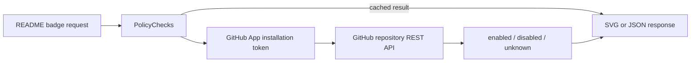

<picture>
    <source media="(prefers-color-scheme: dark)" srcset="docs/assets/banner-dark-1.png">
    <source media="(prefers-color-scheme: light)" srcset="docs/assets/banner-light-1.png">
    
</picture>

<!-- prettier-ignore-start -->
[](https://github.com/reponomics/PolicyChecks/actions/workflows/ci.yml)
[](https://scorecard.dev/viewer/?uri=github.com/reponomics/PolicyChecks)
[](LICENSE)
[](.nvmrc)
[](https://github.com/apps/policychecks)
<!-- prettier-ignore-end -->

**Badges for GitHub repository settings that public APIs don't expose.**

## What is PolicyChecks?

Several repository settings aren't exposed to unauthenticated callers through the GitHub API, which prevents public badge services from reporting them: whether Actions must be pinned to a full-length commit SHA, whether secret push protection is on, whether the default branch blocks force pushes.

PolicyChecks is a GitHub App and a badge service. Install the App on a repository, grant it repository `Administration: Read`, and each of those settings becomes a badge. It reports what the GitHub API says about a setting and nothing more: no code is scanned, and no value is inferred that the API didn't give.

## See it in action

The badges below are live, and they belong to this repository. They come from the public instance at `policychecks.reponomics.org`.

**Actions and releases**

<!-- prettier-ignore-start -->
[](https://policychecks.reponomics.org/github/reponomics/PolicyChecks/sha-pinning-required/details.json)
[](https://policychecks.reponomics.org/github/reponomics/PolicyChecks/immutable-releases/details.json)
<!-- prettier-ignore-end -->

**Secret protection**

<!-- prettier-ignore-start -->
[](https://policychecks.reponomics.org/github/reponomics/PolicyChecks/secret-scanning-enabled/details.json)
[](https://policychecks.reponomics.org/github/reponomics/PolicyChecks/secret-push-protection-enabled/details.json)
<!-- prettier-ignore-end -->

**Default branch rules**

<!-- prettier-ignore-start -->
[](https://policychecks.reponomics.org/github/reponomics/PolicyChecks/default-branch-force-pushes-blocked/details.json)
[](https://policychecks.reponomics.org/github/reponomics/PolicyChecks/default-branch-signed-commits-required/details.json)
[](https://policychecks.reponomics.org/github/reponomics/PolicyChecks/default-branch-linear-history-required/details.json)
[](https://policychecks.reponomics.org/github/reponomics/PolicyChecks/default-branch-deletion-blocked/details.json)
[](https://policychecks.reponomics.org/github/reponomics/PolicyChecks/default-branch-pull-request-required/details.json)
[](https://policychecks.reponomics.org/github/reponomics/PolicyChecks/default-branch-status-checks-required/details.json)
<!-- prettier-ignore-end -->

**Repository and community**

<!-- prettier-ignore-start -->
[](https://policychecks.reponomics.org/github/reponomics/PolicyChecks/web-commit-signoff-required/details.json)
[](https://policychecks.reponomics.org/github/reponomics/PolicyChecks/community-health/details.json)
<!-- prettier-ignore-end -->

Every badge links to its `details.json`, which names the GitHub endpoint and the fields the result came from.

## Quick start

**1. Install the GitHub App**

Install [PolicyChecks](https://github.com/apps/policychecks) on the repositories you want badges for. The App asks for repository `Administration: Read` and nothing else.

**2. Add a badge to your README**

Pick a badge ID from [Supported checks](#supported-checks) and substitute your own `OWNER` and `REPO`:

```markdown
[](https://policychecks.reponomics.org/github/OWNER/REPO/sha-pinning-required/details.json)
```

The URL pattern is the same for every badge:

```text
https://policychecks.reponomics.org/github/OWNER/REPO/BADGE_ID.svg
```

**3. Commit and push**

The badge should appear after the service evaluates the repository. If it shows `unknown`, see [Status semantics](#status-semantics) — the most common cause is that the App is not installed on that repository yet.

## Supported checks

| Check | What it reports | Badge ID | GitHub REST source |
| --- | --- | --- | --- |
| SHA pinning | Actions must be pinned to a full-length commit SHA | `sha-pinning-required` | `/repos/{owner}/{repo}/actions/permissions` |
| Immutable releases | Assets and tags cannot be modified once a release is published | `immutable-releases` | `/repos/{owner}/{repo}/immutable-releases` |
| Secret scanning | Secret scanning is enabled | `secret-scanning-enabled` | `/repos/{owner}/{repo}` |
| Secret push protection | Pushes containing supported secrets are blocked | `secret-push-protection-enabled` | `/repos/{owner}/{repo}` |
| Web signoff | Web-based commits require a sign-off | `web-commit-signoff-required` | `/repos/{owner}/{repo}` |
| Force pushes blocked | Force pushes to the default branch are blocked | `default-branch-force-pushes-blocked` | `/repos/{owner}/{repo}/rules/branches/{branch}` |
| Signed commits | Commits to the default branch need verified signatures | `default-branch-signed-commits-required` | `/repos/{owner}/{repo}/rules/branches/{branch}` |
| Linear history | Merge commits are blocked on the default branch | `default-branch-linear-history-required` | `/repos/{owner}/{repo}/rules/branches/{branch}` |
| Deletion blocked | Only bypass actors may delete the default branch | `default-branch-deletion-blocked` | `/repos/{owner}/{repo}/rules/branches/{branch}` |
| Pull request required | Changes must reach the default branch through a pull request | `default-branch-pull-request-required` | `/repos/{owner}/{repo}/rules/branches/{branch}` |
| Status checks | Status checks must pass before the default branch updates | `default-branch-status-checks-required` | `/repos/{owner}/{repo}/rules/branches/{branch}` |
| Community health | GitHub's community profile score, rendered as `NN/100` | `community-health` | `/repos/{owner}/{repo}/community/profile` |

Rule-based checks are evaluated against the repository's default branch.

## How it works



Each badge maps one GitHub API field to one status. Take SHA pinning: GitHub lets an administrator require that every Action in a workflow is pinned to a full-length commit SHA, and reports that as `sha_pinning_required` on the Actions permissions endpoint.

<picture>
    <source media="(prefers-color-scheme: dark)" srcset="docs/assets/full-sha-pinned-setting-dark.png">
    <source media="(prefers-color-scheme: light)" srcset="docs/assets/full-sha-pinned-setting-light.png">
    
</picture>

PolicyChecks reads that field and renders the result. It never opens a workflow file to see whether the Actions in the repository are _actually_ pinned — that's a different question, and a different kind of tool answers it. See [Scope](#scope).

### Status semantics

| Status     | Meaning                                      |
| ---------- | -------------------------------------------- |
| `enabled`  | The API clearly reported the setting as on.  |
| `disabled` | The API clearly reported the setting as off. |
| `unknown`  | Everything else.                             |

`unknown` covers the App not being installed on the repository, authorization failures, rate limiting, failed requests, and any response that doesn't clearly answer the question. If the answer is ambiguous, the badge says so rather than guessing. Community health works the same way, except that a conclusive result is a score instead of `enabled`/`disabled`.

### Caching

Results are cached in memory for up to about an hour, and responses go out with `Cache-Control: public, max-age=300, stale-while-revalidate=300`. A settings change can take a while to reach a badge, so treat badges as cached signals rather than real-time audits.

## API

Every badge ID supports the same response shapes:

```text
GET /github/{owner}/{repo}/{badge-id}.svg            # SVG badge
GET /github/{owner}/{repo}/{badge-id}.json           # Shields-compatible JSON, for custom badge tooling
GET /github/{owner}/{repo}/{badge-id}/details.json   # The evaluation record behind the badge
GET /github/{owner}/{repo}/info.json                 # All supported checks for one repository
```

A request for an unrecognized badge ID returns `404` with `{"error": "unsupported_badge"}`.

`details.json` is the one worth knowing about. It names the endpoint and fields behind the result, so anyone can check a badge against its source:

```console
$ curl https://policychecks.reponomics.org/github/reponomics/PolicyChecks/sha-pinning-required/details.json
{
  "badgeId": "sha-pinning-required",
  "owner": "reponomics",
  "repo": "PolicyChecks",
  "repository": {
    "owner": "reponomics",
    "repo": "PolicyChecks",
    "full_name": "reponomics/PolicyChecks"
  },
  "result": "enabled",
  "source": {
    "provider": "github",
    "api": "REST",
    "endpoint": "GET /repos/{owner}/{repo}/actions/permissions",
    "fields": ["sha_pinning_required"]
  },
  "checked_at": "2026-08-27T17:45:18.237Z",
  "details": {
    "sha_pinning_required": true
  }
}
```

<!-- prettier-ignore-start -->
> [!NOTE]
> `info.json` returns every supported check for a repository today, but treat it as unstable. [ADR 0001](docs/adr/0001-badge-publication-consent.md) proposes removing it and letting maintainers choose which checks are published instead. That direction is accepted but not implemented.
<!-- prettier-ignore-end -->

## Permissions and data access

- PolicyChecks asks for repository `Administration: Read`, and no other permission.
- It holds no write permission, so it can't modify anything in your repository.
- It doesn't read repository source code.
- It doesn't call organization APIs.
- The GitHub calls it makes itself are `GET`s against six repository routes. [`test/github/api-usage-policy.test.ts`](test/github/api-usage-policy.test.ts) pins that list and fails the build if a write verb, GraphQL query, pagination, search, or organization/user repository listing shows up in the source. (Installation tokens are minted separately by `@octokit/auth-app`, which posts to GitHub's token endpoint.)
- Only the fields listed under [Supported checks](#supported-checks) go into a result. GitHub returns whole objects; PolicyChecks reads what the check needs and ignores the rest.
- When a response is inconclusive, the badge says `unknown` instead of working the answer out some other way.

The App works on public and private repositories where it has been installed. Settings an organization applies to a repository show up on these repository endpoints too.

[PRIVACY.md](PRIVACY.md) covers what the service processes and stores.

## Scope

A PolicyChecks badge tells you one thing: what the GitHub API reported about a specific setting when the check ran.

It is not a security audit, not a historical compliance record, and not a codebase scanner. Enabling a setting does not establish that a project has followed that policy in the past, and PolicyChecks makes no claim that it has.

The SHA-pinning example cuts both ways:

- A repository can contain unpinned Actions and still show `enabled`, because those workflows may predate the setting.
- A repository can pin every Action meticulously and still show `disabled`, because nobody ticked the box.

That gap is the point. PolicyChecks reports policy, not practice. A maintainer who has turned on the inconvenient settings gets a way to say so publicly — nothing more, and nothing less.

## PolicyChecks vs. Scorecard and Shields

These tools answer different questions, and they're worth using together.

|  | Reports on | Data source | Granularity |
| --- | --- | --- | --- |
| **PolicyChecks** | Selected repository administration settings | Authenticated GitHub REST reads through an installed App | One badge per setting |
| **[OpenSSF Scorecard](https://github.com/ossf/scorecard)** | Actual codebase, workflow, and CI/CD practices, evaluated in depth | Repository contents and metadata analysis | An aggregate score, with per-check results available from its API |
| **[Shields.io](https://github.com/badges/shields)** | A very wide range of project signals | Publicly accessible data | One badge per signal |

Scorecard is the more rigorous supply-chain tool. It reads the workflow files and can tell you whether Actions are genuinely pinned; PolicyChecks doesn't attempt that. PolicyChecks covers the narrower case where the answer sits behind a permission that public badge services don't have.

## Limitations

- Settings can change at any time after a check runs. PolicyChecks doesn't track historical continuity, so a rule could be turned off temporarily without any badge reflecting it.
- Bypass actors are not evaluated. A ruleset that grants bypass permissions still reports as `enabled`.
- Classic branch protection rules are not evaluated — only rulesets, following GitHub's guidance to prefer them going forward.
- Rule-based checks look at the default branch, and nothing else.
- The result cache lives in memory, per Worker isolate. It reduces API pressure, but different isolates can hold different results.

## Documentation

|  |  |
| --- | --- |
| [CONTRIBUTING.md](CONTRIBUTING.md) | Local setup, verification commands, and what makes a good contribution |
| [SECURITY.md](SECURITY.md) | Reporting a vulnerability |
| [PRIVACY.md](PRIVACY.md) | What the service processes and what it stores |
| [SUPPORT.md](SUPPORT.md) | Where to ask about a specific repository's badge |
| [docs/operations.md](docs/operations.md) | Running the service: caching, rate-limit policy, deployment, monitoring |
| [ADR 0001](docs/adr/0001-badge-publication-consent.md) and [its plan](docs/plans/0001-readme-publication-gate.md) | The accepted but unimplemented proposal to let maintainers choose which checks are published |

## Contributing

Contributions are welcome: bug reports, fixes, and new badges. Please open an issue before starting on a feature so we can talk it through. Setup and local development commands are in [CONTRIBUTING.md](CONTRIBUTING.md).

New badges are the most useful contribution. There are two conditions:

1. The check needs no permission beyond repository `Administration: Read`.
2. The result comes from a single GitHub API endpoint, without non-trivial inference.

A setting that can't be read within those constraints isn't a good fit. That boundary is what keeps the App's permission footprint small.

All contributors are expected to follow the [Code of Conduct](CODE_OF_CONDUCT.md).

## License

MIT © 2026 Reponomics Contributors. See [LICENSE](LICENSE).
