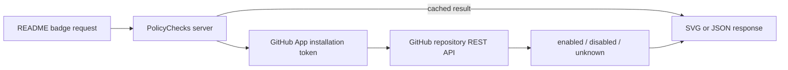
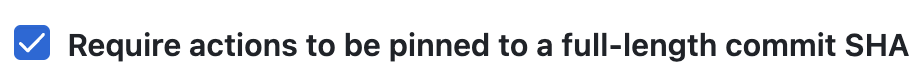

<picture>
    <source media="(prefers-color-scheme: dark)" srcset="docs/assets/banner-dark-1.png">
    <source media="(prefers-color-scheme: light)" srcset="docs/assets/banner-light-1.png">
    
</picture>

<br />

<!-- prettier-ignore-start -->
[](https://github.com/reponomics/PolicyChecks/actions/workflows/ci.yml)
[](https://scorecard.dev/viewer/?uri=github.com/reponomics/PolicyChecks)
[](https://www.bestpractices.dev/projects/14356)
[](https://github.com/apps/policychecks)
<!-- prettier-ignore-end -->

<div align="center"><h2><strong>Badges for GitHub repository settings that other badge services can't see.</strong></h2></div>

<!-- prettier-ignore-start -->
<p align="center">
  <a href="https://policychecks.reponomics.org/github/reponomics/PolicyChecks/secret-push-protection-enabled/details.json"></a>
  <a href="https://policychecks.reponomics.org/github/reponomics/PolicyChecks/web-commit-signoff-required/details.json"></a>
  <a href="https://policychecks.reponomics.org/github/reponomics/PolicyChecks/sha-pinning-required/details.json"></a>
  <a href="https://policychecks.reponomics.org/github/reponomics/PolicyChecks/default-branch-pull-request-required/details.json"></a><br>
  <a href="https://policychecks.reponomics.org/github/reponomics/PolicyChecks/default-branch-force-pushes-blocked/details.json"></a>
  <a href="https://policychecks.reponomics.org/github/reponomics/PolicyChecks/default-branch-status-checks-required/details.json"></a>
  <a href="https://policychecks.reponomics.org/github/reponomics/PolicyChecks/immutable-releases/details.json"></a>
  <a href="https://policychecks.reponomics.org/github/reponomics/PolicyChecks/default-branch-linear-history-required/details.json"></a><br>
  <a href="https://policychecks.reponomics.org/github/reponomics/PolicyChecks/community-health/details.json"></a>
  <a href="https://policychecks.reponomics.org/github/reponomics/PolicyChecks/default-branch-deletion-blocked/details.json"></a>
  <a href="https://policychecks.reponomics.org/github/reponomics/PolicyChecks/secret-scanning-enabled/details.json"></a>
  <a href="https://policychecks.reponomics.org/github/reponomics/PolicyChecks/default-branch-signed-commits-required/details.json"></a>
</p>
<!-- prettier-ignore-end -->

## About PolicyChecks

Public badge services can only see what public APIs report. A repo's git history shows whether a project uses signed commits - but there's no public API to check whether signed commits are required by a project's settings. That's why we created PolicyChecks: a badge service backed by a GitHub app that requests permission to read administrative settings; by installing the PolicyChecks app, maintainers can show that their project follows best practices, not only as a matter of habit, but as a matter of policy.

## Quickstart

**1. Install the GitHub App**

Install [PolicyChecks](https://github.com/apps/policychecks) on your account, and grant it access to the repositories where you wish to display a badge. The App asks for one elevated permission: repository `Administration: Read`. This is the minimum access necessary to serve the badges. We recommend you grant it access only to those repos where you wish to show a badge.

**2. Add a badge to your README**

Once you've installed the app, the badge service will be able to query the GitHub API for the data necessary to display a PolicyChecks badge.

Simply select from the list of [Supported checks](#supported-checks) and substitute your own `OWNER` and `REPO`:

```markdown
[](https://policychecks.reponomics.org/github/OWNER/REPO/sha-pinning-required/details.json)
```

The service supports both personal accounts and organizations; as long as the app is installed on the relevant repository, it can report on its policies, whether those are configured at the repo level or the org level.

The URL pattern is the same for every badge:

```text
https://policychecks.reponomics.org/github/OWNER/REPO/BADGE_ID.svg
```

Besides the SVG, the service also exposes an endpoint for each badge that returns a JSON object containing metadata about what GitHub API endpoint was used to derive the status displayed on the badge:

```text
https://policychecks.reponomics.org/github/OWNER/REPO/BADGE_ID/details.json
```

> [!TIP] \
> Viewing the `details.json` endpoint can be useful when trying to understand why a particular badge is displaying a specific status.

The badge service reports that a setting is `enabled` when the GitHub API responds with data that clearly shows the setting is enabled, and displays `disabled` only if the API clearly reports a setting is not enabled - if the API's response is inconclusive, or the API is unreachable, the badge simply reports `unknown`.

## Supported checks

| Check | What it reports | Badge ID | GitHub REST source |
| --- | --- | --- | --- |
| SHA pinning | Actions must be pinned to a full-length commit SHA | `sha-pinning-required` | `/repos/{owner}/{repo}/actions/permissions` |
| Immutable releases | Assets and tags cannot be modified once a release is published | `immutable-releases` | `/repos/{owner}/{repo}/immutable-releases` |
| Secret scanning | Secret scanning is enabled | `secret-scanning-enabled` | `/repos/{owner}/{repo}` |
| Secret push protection | Pushes containing supported secrets are blocked | `secret-push-protection-enabled` | `/repos/{owner}/{repo}` |
| Web signoff | Web-based commits require a sign-off | `web-commit-signoff-required` | `/repos/{owner}/{repo}` |
| Force pushes blocked | Force pushes to the default branch are blocked | `default-branch-force-pushes-blocked` | `/repos/{owner}/{repo}/rules/branches/{branch}` |
| Signed commits | Commits to the default branch need verified signatures | `default-branch-signed-commits-required` | `/repos/{owner}/{repo}/rules/branches/{branch}` |
| Linear history | Merge commits are blocked on the default branch | `default-branch-linear-history-required` | `/repos/{owner}/{repo}/rules/branches/{branch}` |
| Deletion blocked | Only bypass actors may delete the default branch | `default-branch-deletion-blocked` | `/repos/{owner}/{repo}/rules/branches/{branch}` |
| Pull request required | Changes must reach the default branch through a pull request | `default-branch-pull-request-required` | `/repos/{owner}/{repo}/rules/branches/{branch}` |
| Status checks | Status checks must pass before the default branch updates | `default-branch-status-checks-required` | `/repos/{owner}/{repo}/rules/branches/{branch}` |
| Community health | GitHub's community profile score, rendered as `NN/100` | `community-health` | `/repos/{owner}/{repo}/community/profile` |

Rule-based checks are evaluated against the repository's default branch.

## How it works



Each badge maps one GitHub API field to one recognizable repository setting. We don't try to make sophisticated inferences, and we don't audit whether that setting has ever changed. The badge shows the status of a particular setting, as reported by GitHub at the time of evaluation. For example, there is a setting that allows maintainers to enforce that all repo workflows use full-length SHA-pinned actions. In the Settings UI, it looks like this:

<picture>
    <source media="(prefers-color-scheme: dark)" srcset="docs/assets/full-sha-pinned-setting-dark.png">
    <source media="(prefers-color-scheme: light)" srcset="docs/assets/full-sha-pinned-setting-light.png">
    
</picture>

Github's repository `/actions/permissions` endpoint reports whether that checkbox is checked or not. PolicyChecks queries that endpoint (which requires repository `Administration: Read` permissions), and renders a badge based the response.

### Status semantics

| Status     | Meaning                                      |
| ---------- | -------------------------------------------- |
| `enabled`  | The API clearly reported the setting as on.  |
| `disabled` | The API clearly reported the setting as off. |
| `unknown`  | Everything else.                             |

`unknown` covers the App not being installed on the repository, authorization failures, rate limiting, failed requests, and any response that doesn't clearly answer the question. If the answer is ambiguous, the badge says so rather than guessing. Community health works the same way, except that the response is a percentage, instead of `enabled`/`disabled`.

### Caching

Results are cached in memory for up to about an hour, and responses go out with `Cache-Control: public, max-age=300, stale-while-revalidate=300`. It can take a little bit of time for a settings change to be picked up by the GitHub API, so treat badges as cached signals rather than real-time data.

## API

Every badge ID supports the same response shapes:

```text
GET /github/{owner}/{repo}/{badge-id}.svg            # SVG badge
GET /github/{owner}/{repo}/{badge-id}.json           # Shields-compatible JSON, for custom badge tooling
GET /github/{owner}/{repo}/{badge-id}/details.json   # The evaluation record behind the badge
GET /github/{owner}/{repo}/info.json                 # All supported checks for one repository
```

A request for an unrecognized badge ID returns `404` with `{"error": "unsupported_badge"}`.

`details.json` names the endpoint and fields behind the result, so anyone can check a badge against its source:

```console
$ curl https://policychecks.reponomics.org/github/reponomics/PolicyChecks/sha-pinning-required/details.json
{
  "badgeId": "sha-pinning-required",
  "owner": "reponomics",
  "repo": "PolicyChecks",
  "repository": {
    "owner": "reponomics",
    "repo": "PolicyChecks",
    "full_name": "reponomics/PolicyChecks"
  },
  "result": "enabled",
  "source": {
    "provider": "github",
    "api": "REST",
    "endpoint": "GET /repos/{owner}/{repo}/actions/permissions",
    "fields": ["sha_pinning_required"]
  },
  "checked_at": "2026-08-27T17:45:18.237Z",
  "details": {
    "sha_pinning_required": true
  }
}
```

## Permissions and data access

- PolicyChecks asks for repository `Administration: Read`, and no other permission.
- It holds no write permission, so it can't modify anything in your repository.
- It doesn't read repository source code.
- It doesn't call organization APIs (but it can still report whether a policy is enforced by repo settings even if those settings are inherited from organization policies).
- The service makes only `GET` requests to the GitHub API. [`test/github/api-usage-policy.test.ts`](test/github/api-usage-policy.test.ts) pins the list of endpoints that it queries and CI fails if a write verb, GraphQL query, pagination, search, or organization/user repository listing shows up in the source.
- Only the fields listed under [Supported checks](#supported-checks) go into a result. Any additional data in the API response is ignored.
- When a response is inconclusive, the badge says `unknown` instead of working the answer out some other way.

See [PRIVACY.md](PRIVACY.md) for additional details about how the service handles data.

## Scope

PolicyChecks fills a modest gap in the OSS tooling ecosystem.

While trusted services, such as [OSSF Scorecard](https://scorecard.dev/), provide reliable ways to "assess open source projects for security risks through a series of auomated checks", they do not provide single-endpoint badges that represent _specific_ best practices or administrative policies. Meanwhile, other invaluable services like [Shields.io](https://github.com/badges/shields) offer a wide range of badges that report on the health and security posture of a GitHub repository, but they are limited to providing GitHub data that is publicly accessible.

PolicyChecks expands the scope of available badges that relay data provided by GitHub's API. By installing the PolicyChecks app, the badge service is able to access data that public endpoints do not expose.

## Limitations

A PolicyChecks badge tells you one simple thing: what the GitHub API reports about a specific repository setting at the time of evaluation.

It is not a security audit, not a historical compliance record, and not a codebase scanner. This has two important implications:

(i) The presence of a setting that requires some condition to hold does not imply anything about whether that condition _actually holds_ - e.g., if a maintainer enables a ruleset that requires signed commits, that only applies to commits entering the codebase _going forward_.

(ii) Inversely, a repository can fully satisfy a condition without that condition being set as an administrative requirement.

In addition, we do _not_ report anything about the presence or absence of _bypass actors_ (users or roles that are allowed to bypass branch rulesets). This is for two reasons: (i) we cannot conlusively establish the presence or absence of bypass actors solely on the basis of `Administration: Read` permissions, and we do not deem that this information would justify an expansion in requested permissions; (ii) making claims about bypass actors could imply unwarranted assurances about a repository's real practices. In reality, any administrator can temporarily disable a setting or ruleset, force some change into the codebase, and then reenable the setting. Without historical tracking, PolicyChecks cannot report on this sort of activity, which is qualitatively similar to the activity of a bypass actor.

Rather than excluding branch ruleset conditions from the range of supported badges, we prefer to include them on the basis of the information that is available with `Administration: Read` permissions, and make it clear that the existence of bypass actors is not taken into account for ruleset-based badges. These limitations should be taken into account before making any claims on the basis of a PolicyChecks badge.

## Contributing

Contributions are welcome: bug reports, fixes, documentation, and new badges. Please open an issue before starting on a feature so we can talk it through. Setup and local development commands are in [CONTRIBUTING.md](CONTRIBUTING.md).

New badges are the most useful contribution. There are two conditions:

1. The check needs no permission beyond repository `Administration: Read`.
2. The result can be deterministically established on the basis of a small number of queries (preferably one), without non-trivial inference.

A setting that can't be read within those constraints isn't a good fit. That boundary is what keeps the App's permission footprint small.

All contributors are expected to follow the [Code of Conduct](CODE_OF_CONDUCT.md).

## License

See [LICENSE](LICENSE)

MIT (c) 2026 Reponomics
